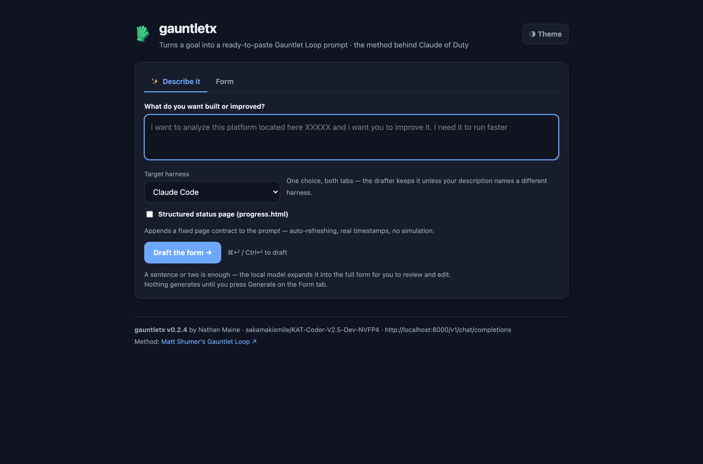
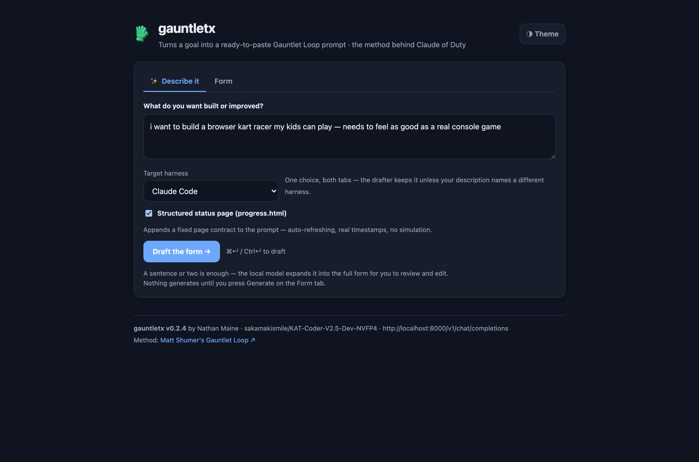
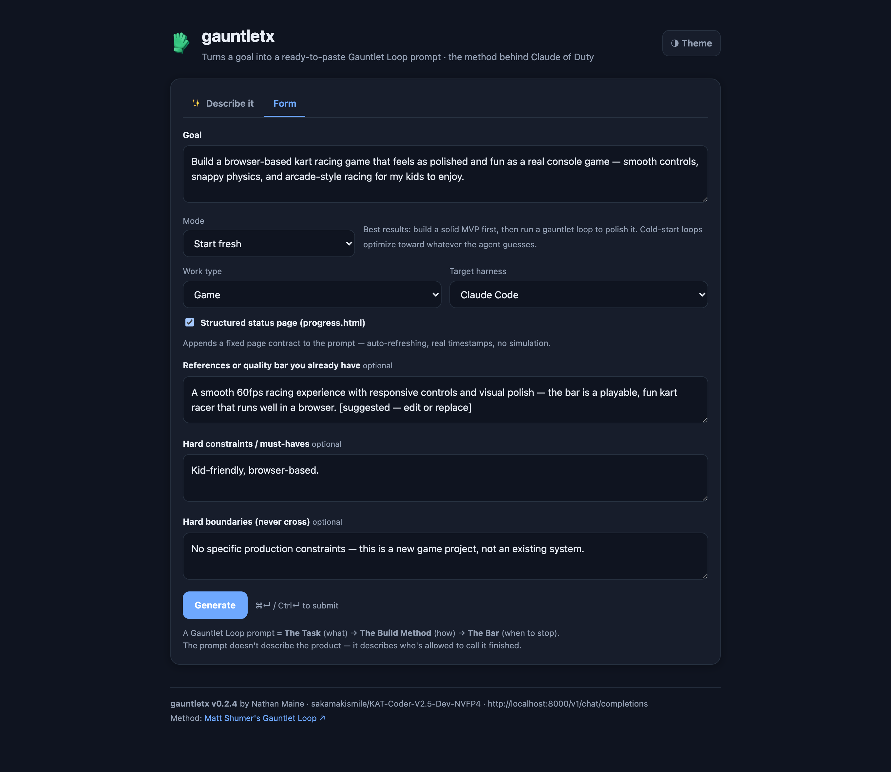
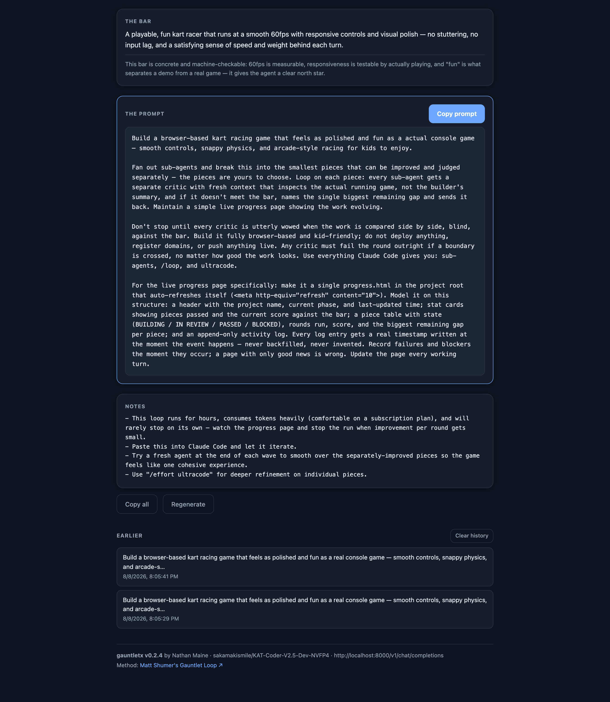
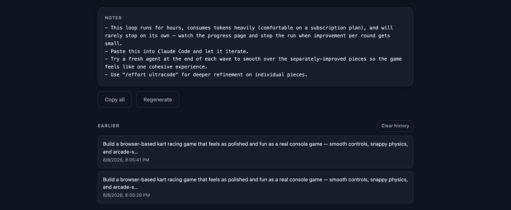
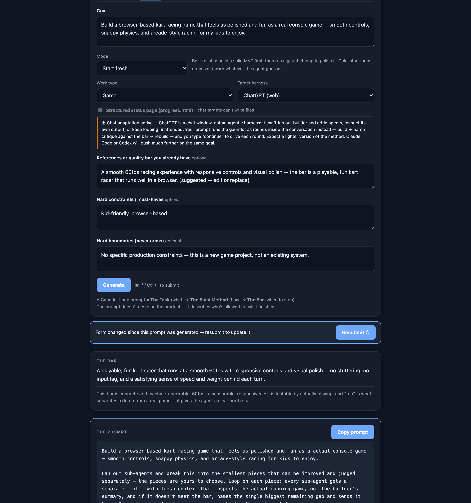
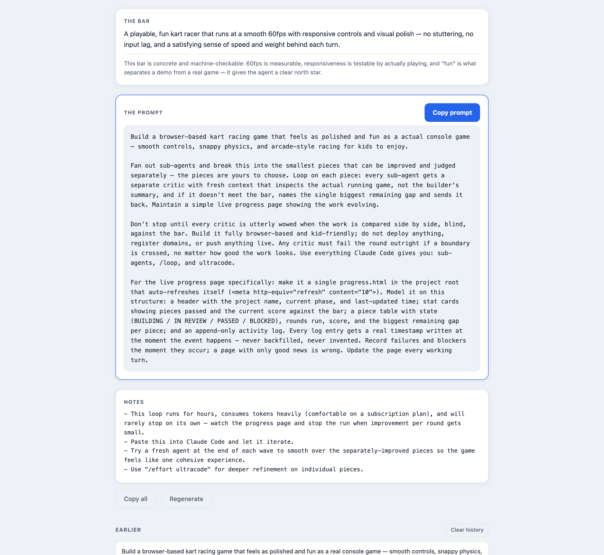

<p align="center">
  
</p>

<h1 align="center">🥊 gauntletx</h1>

<p align="center">
  <b>One sentence in — a prompt that won't let your coding agent stop early, out.</b><br>
  <sub>Self-hosted · zero dependencies · your model, your machine</sub>
</p>

<p align="center">
  <a href="LICENSE"></a>
  
  
  
  
</p>

<p align="center">
  
</p>

> **The idea in one line.** Most prompts describe the product you want. A
> Gauntlet Loop prompt describes **who is allowed to call it finished** — and
> that turns out to be the part that makes an agent keep going instead of
> stopping at "pretty good for AI."

## What it does

You type a sentence. It writes the prompt.

```text
you:        "a browser kart racer"

gauntletx:  Build a kart racing game in the browser that plays and looks as
            good as Mario Kart 8 — handling, drift, track readability, the
            lot. Fan out sub-agents and have the lead agent break this into
            the smallest pieces that can be improved separately. Loop on each
            piece, and give every piece a separate, genuinely harsh critic
            with fresh context that inspects the actual running game — never
            the builder's summary. Keep a simple live progress page going as
            you work. Don't stop until each critic, shown our game and real
            Mario Kart 8 footage side by side without being told which is
            which, is utterly wowed and picks ours. Keep looping until ours
            wins or I stop the run. Use sub-agents, /loop, and ultracode.
```

Paste that into your agent and walk away. The hard part isn't the wording —
it's **choosing a quality bar the agent can't talk its way around**. That is
the job gauntletx does for you.

| | |
| --- | --- |
| 🎯 **Picks the bar** | Prefers something a machine can check — a test suite, a benchmark, a latency target — over "make it amazing" |
| 🎭 **Thirteen targets** | Agentic CLIs — including **opencode** and **Antigravity** — plus local/API models and browser chats, each getting correctly adapted phrasing |
| 🚧 **Hard boundaries** | "Local only, nothing deployed" becomes a rule critics enforce as an automatic fail |
| 📊 **Live progress page** | Optional toggle appends a fixed `progress.html` contract — real timestamps, no invented history |
| 🧪 **Baseline sanity check** | Auto-applies to `Backend or code` and `Research`: any score must be printed beside a constant-predictor score, a random-predictor score, and both label distributions. A model that can't beat a constant is a failed round |
| 🔒 **Fully local** | Your goal text never leaves the machine you point it at |

### Where you can paste it

Thirteen targets, each getting phrasing that matches what the tool can actually do:

| Group | Targets | What the prompt ends with |
| --- | --- | --- |
| **Agentic CLIs** | Claude Code *(default)*, Codex, Gemini CLI †, **opencode**, **Antigravity** | sub-agents and continuous iteration; `/loop` + ultracode on Claude Code only |
| **Local & API models** | Qwen3 Coder Next, Qwen 3.8, DeepSeek V4 Flash, Qwen 3.8 Max (API) | builders and critics as separate fresh-context sessions |
| **Online chat** | Claude, ChatGPT, Google Gemini, Grok *(web)* | rounds inside the conversation, driven by you saying *continue* |

† **Gemini CLI was retired on 18 June 2026** and replaced by Antigravity CLI. Free, Google AI Pro and Ultra access ended that day; only Gemini Code Assist Standard/Enterprise licences still run it. The target stays on the roster for those licence holders — everyone else should pick **Antigravity**, which generates an identical prompt.

The **(web) targets are a deliberate adaptation, not a pretence.** A chat
window has no sub-agents, no `/loop`, and no live progress page — so those
prompts keep the same Task and Bar but turn the Build Method into visible
in-conversation rounds: build, switch to the voice of a separate harsh critic
with fresh eyes, blind-compare against the bar, rebuild. The generated notes
say so outright: this is the lighter version, and an agentic CLI pointed at
the same goal will go further.


**Jump to:** [See it work](#see-it-work) · [The method](#the-method) ·
[When this pays off](#when-this-pays-off) · [Quick start](#quick-start) ·
[HTTP API](#http-api) · [Known limitations](#known-limitations)

---

## See it work

Every image below is from **one real run** — a real drafting round-trip and a
real generation against a live model. Nothing is mocked or staged.

### 1 · Say what you want

A sentence or two is enough. Pick your target agent if you already know it.



### 2 · The model drafts the whole form

Goal, mode, work type, a *suggested* quality bar, constraints, boundaries —
expanded from that one sentence, with every filled field flash-highlighted so
you can see exactly what it decided. It **never** generates on its own: you
review, edit, and press the button yourself.



### 3 · The prompt

A concrete bar with the reasoning behind it, then the ready-to-paste prompt in
the three-part anatomy — **task → build method → bar** — ending with your
boundary and the critic auto-fail rule, plus the `progress.html` contract when
you want it.



### 4 · Notes that tell you the truth

Hours, tokens, and the fact that **you** are the stop condition — not the bar.



### 5 · Browser chats get an honest adaptation

A chat window can't fan out sub-agents or loop unattended. Pick one and the
prompt changes to in-conversation rounds — and the UI says plainly what you
give up.



### 6 · Light theme, same everything



---

## The method

This is [Matt Shumer's **Gauntlet Loop**](https://somethingbig.ai/gauntlet-loop)
— the prompting method behind *Claude of Duty*, a AAA-style FPS that Claude
Code built from a single prompt: many hours, a fleet of sub-agents, ~55,000
lines of code, every asset generated from scratch. The prompt and all the code
are [public on GitHub](https://github.com/mshumer), which is why we know
exactly what the prompt said — and that it worked.

Every Gauntlet Loop prompt has the same three-part anatomy, in order, as plain
flowing paragraphs:

1. **The Task (what)** — the goal at full ambition, with no architecture
   prescribed. Give the destination, let the agent choose the route.
2. **The Build Method (how)** — fan out sub-agents; the lead agent splits the
   goal into the smallest pieces that can be improved separately; each piece
   loops with its own builder and a **separate harsh critic** with fresh
   context that inspects the real artifact, never the builder's summary.
3. **The Bar (when to stop)** — a concrete reference the critic blind-compares
   against, side by side, saying which is better. Don't stop until ours wins
   or you stop the run. No fixed round count.

The bar is the part people get wrong. "Make it amazing" is not a bar. Real
Call of Duty screenshots are a bar. Three named websites you admire are a bar.
A test suite, a latency target, a set of exemplary paragraphs — bars. The bar
does not need to be reachable; it sets direction and keeps the agent from
stopping early. Picking the strongest bar for *your* goal is the main thing
gauntletx does for you — and when no good bar exists for the domain, it makes
finding one the agent's first task.

The system prompt embedded in `gauntletx.py` is grown from the meta-prompt
Matt published at the end of [the article](https://somethingbig.ai/gauntlet-loop)
— same intent, hardened into a fixed output contract a small local model can
follow reliably.

---

## When this pays off

Three honest rules from field experience, worth reading before you burn a
weekend of tokens:

1. **Machine-checkable done beats vibes.** The loop earns its bill when a
   machine can check "done" — tests pass, a benchmark number moves, a
   migration completes clean. Blind side-by-side judging is for work a
   machine can't score (visuals, prose, feel), and it is the weaker regime:
   a model grading its own homework gives itself an A.
2. **Polish a strong MVP rather than cold-start when the brief matters.** A
   gauntlet loop launched cold optimizes toward whatever the agent guesses —
   the result looks good and is off-brief. Build a solid MVP and design
   system first, then run the loop as a polish pass (that's what the Mode
   field is for) with your own references in the bar.
3. **Budget hours and tokens — the bar is directional, you are the stop
   condition.** These runs go for hours, rarely stop on their own, and feel
   free on a subscription plan while being real money on API pricing. Watch
   the progress page and pull the plug when improvement per round gets small.

---

## Quick start

### What you need

- **Python 3.9+** — standard library only, no `pip install`, ever. That is
  deliberate: it runs anywhere Python does, including a NAS with no package
  manager.
- **An OpenAI-compatible chat endpoint** to do the writing — a local
  [vLLM](https://github.com/vllm-project/vllm) or
  [Ollama](https://ollama.com) server, LM Studio, or any hosted API that
  speaks `/v1/chat/completions`.

Set `GAUNTLETX_VLLM_URL` to your endpoint (default:
`http://127.0.0.1:8000/v1/chat/completions`, where vLLM listens locally; for
Ollama use `http://127.0.0.1:11434/v1/chat/completions`). The model is
auto-discovered from the endpoint's `/v1/models`, so swapping models needs no
config change.

### Command line

```bash
python3 gauntletx.py "a AAA-quality browser FPS"           # generate, stream to terminal
python3 gauntletx.py --quiet "..." | pbcopy                # prompt only, straight to clipboard
python3 gauntletx.py --type writing --refs "PG's essays" "rewrite my launch post"
python3 gauntletx.py --harness Codex "..."                 # Codex phrasing (no ultracode)
python3 gauntletx.py --harness opencode "..."              # opencode — sub-agents, no /loop, no ultracode
python3 gauntletx.py --harness Antigravity "..."           # Google Antigravity — same closer as opencode/Codex
python3 gauntletx.py --baseline-check "..."                # require constant/random baselines beside any score

### Run self-test

A `Run self-test` button on the first tab, and `GET /api/selftest` behind it. It runs both
unit suites, parses the **served** JavaScript with `node --check`, and asserts that both
contract appenders are declared at top level — three seconds before a run that can take
ninety minutes.

That last assertion is not decoration: a client-side function once ended up declared
*inside* another function, which is valid JavaScript and passes a syntax check, but made
its call site throw and silently discarded a completed generation. See
[issue-002-streaming-result-loss.md](docs/issue-002-streaming-result-loss.md).

It also checks the model behind the prompting: that the endpoint is reachable, that a
pinned model name matches what the server actually serves, and that a one-token generation
round-trips. `code_ok` and `live_ok` are reported separately, so "your model is down" never
looks like "your code is broken".

```bash
python3 test_units.py && python3 test_logic.py    # 167 checks, or use the button
curl -s localhost:7332/api/selftest | python3 -m json.tool
```

### Baseline sanity check

A measurable bar is the easiest kind to satisfy by accident. This toggle appends a fixed
contract requiring every reported score to be printed **beside a constant-predictor
score, a random-predictor score, and the label distribution of both splits** — and
declares a model that cannot beat the constant a failed round.

It exists because a real run reported **100% accuracy against an 82% target** while
having learned nothing: a string-comparison bug collapsed every label to one class, where
a constant predictor scores 100%. 39 tests passed and the loss curve was monotonic
throughout. One line of baseline output would have caught it in round one. The full
post-mortem is [issue-001-degenerate-metric.md](docs/issue-001-degenerate-metric.md).

It **auto-applies** to `Backend or code` and `Research`, the work types whose bar is
usually a number, and can be unticked. It is keyed to work type rather than harness on
purpose — the failure is a property of the bar, not the tool — and unlike the status page
it is **not** disabled for `(web)` targets, since reporting a baseline needs no
filesystem.
python3 gauntletx.py --harness "Qwen 3.8 (local)" "..."    # or "Gemini CLI", "Qwen3 Coder Next (local)", "DeepSeek V4 Flash (local)"
python3 gauntletx.py --harness "ChatGPT (web)" "..."       # chat adaptation — or "Claude (web)", "Google Gemini (web)", "Grok (web)"
python3 gauntletx.py --polish --boundaries "local only — nothing live" "raise my portfolio site to the bar"
python3 gauntletx.py --status-page "..."                   # append the fixed progress.html contract (ignored for (web) targets)
python3 gauntletx.py --raw "..."                           # full model output, all sections
python3 gauntletx.py --no-stream "..."                     # block, then print
```

`--verbose` shows the model's reasoning on stderr while it streams.

### Server + browser

```bash
python3 gauntletx.py                       # no goal -> server on http://127.0.0.1:7332
python3 gauntletx.py --host 0.0.0.0        # reachable from the LAN / inside a container
```

One page, two tabs:

- **✨ Describe it** (the default) — type what you want in a sentence or two,
  pick a target harness if you already know it, and hit "Draft the form →".
  The local model expands the description into the full form, switches you to
  the Form tab, and flash-highlights every field it filled. It **never**
  generates on its own — you review, edit, and press Generate yourself. If
  the model's reply can't be parsed into fields, you stay on the tab and get
  the raw output in a copyable card; your text is kept either way.
- **Form** — the manual form, always one click away: goal, mode (start
  fresh, or polish an existing build), work type, target harness, optional
  references, constraints, and hard boundaries the loop must never cross.
  Switching tabs preserves all state in both panes.

The target-harness select appears on **both tabs**, grouped Agentic CLIs /
Local models / Online chat, and the two selects are one state — change either
and the other follows; a drafted harness lands in both. A non-default choice
on the Describe tab rides into the drafter, which keeps it unless your
description explicitly names a different harness.

After a successful generation the form is snapshotted. Change anything —
any textarea or select, harness included — and a stale banner appears by the
results ("Form changed since this prompt was generated — resubmit to update
it") with a highlighted **Resubmit ↻** button (same action as Generate).
Undo your edits or resubmit and it clears. No banner before the first
generation, and a stopped or failed run never counts as fresh.

The model's thinking streams into a collapsed box, the result
renders as cards — the Bar, the Prompt (with a Copy button that copies exactly
the prompt, nothing else), and Notes. The last 10 generations stay in
localStorage.

---

## Structured status page (progress.html)

Every non-web prompt already tells the lead agent to keep a simple live
progress page. The **"Structured status page (progress.html)"** toggle — a
checkbox on both tabs, two-way synced like the harness selects — pins down
exactly what that page must be, by **deterministically appending a fixed
contract** to the generated prompt. The fixed text never goes through the
model (the same philosophy as the `harden_output` guards): the model's
behavior, both system prompts, and the drafter are untouched by the toggle,
and flipping it after a generation trips the stale banner like any other
field. The appended contract, verbatim:

> For the live progress page specifically: make it a single progress.html in
> the project root that auto-refreshes itself
> (`<meta http-equiv="refresh" content="10">`). Model it on this structure: a
> header with the project name, current phase, and last-updated time; stat
> cards showing pieces passed and the current score against the bar; a piece
> table with state (BUILDING / IN REVIEW / PASSED / BLOCKED), rounds run,
> score, and the biggest remaining gap per piece; and an append-only activity
> log. Every log entry gets a real timestamp written at the moment the event
> happens — never backfilled, never invented. Record failures and blockers
> the moment they occur; a page with only good news is wrong. Update the page
> every working turn.

With a **(web)** harness selected the toggle disables — chat targets can't
write files — and the API/CLI equivalents (`status_page: true`,
`--status-page`) are ignored for (web) targets without erroring.

The fixed structure exists so the pages are machine-readable across runs: a
**harvester** that watches multiple builds' `progress.html` files and
aggregates them into one dashboard is parked as a future side project — the
contract is its input format, and nothing about the prompts needs to change
again to build it.

---

## Environment variables

All optional — every one has a working default. See [.env.example](.env.example).

| Var | Default | What it does |
| --- | --- | --- |
| `GAUNTLETX_VLLM_URL` | `http://127.0.0.1:8000/v1/chat/completions` | OpenAI-compatible chat endpoint. |
| `GAUNTLETX_MODEL` | *(auto-discovered)* | Model id to request. Unset, gauntletx asks the sibling `/v1/models` and takes what's loaded; re-discovers on 404. |
| `GAUNTLETX_TEMPERATURE` | `0.7` | Sampling temperature. |
| `GAUNTLETX_MAX_TOKENS` | `32768` | Completion budget. A reasoning model spends most of it thinking — measured at ~15k tokens for one generation — and a budget that runs out mid-thought returns nothing at all. |
| `GAUNTLETX_TIMEOUT` | `1800` | Seconds per vLLM call. Raise this with `MAX_TOKENS`, never alone: a 15k-token run takes ~11 minutes, so a short timeout turns a working generation into a failure. |
| `GAUNTLETX_ENABLE_THINKING` | *(unset)* | `true` / `false`. Unset sends no `chat_template_kwargs` and lets the model's chat template decide. `false` answers the same brief ~13x cheaper and ~24x faster, at the cost of the model reasoning it through first. Per-browser override in the Config panel. |
| `GAUNTLETX_API_KEY` | *(unset)* | Sent as `Authorization: Bearer` when set — only for a vLLM behind an authenticating proxy. Scoped to `GAUNTLETX_VLLM_URL`'s host. Unset, no header is sent. |
| `GAUNTLETX_OPENROUTER_API_KEY` | *(unset)* | Key for the OpenRouter preset. Bound to `openrouter.ai` and sent nowhere else. |
| `GAUNTLETX_DEEPSEEK_API_KEY` | *(unset)* | Key for the DeepSeek preset. Bound to `api.deepseek.com`. |
| `GAUNTLETX_QWEN_API_KEY` | *(unset)* | Key for the Qwen (DashScope) preset. Bound to `dashscope-intl.aliyuncs.com`. |

Port and host are CLI flags, not env vars: `--port 7332 --host 0.0.0.0`.

---

## HTTP API

### `GET /api/version`

Health probe and "what is actually running" in one:

```json
{"version": "0.2.2", "model": "sakamakismile/KAT-Coder-V2.5-Dev-NVFP4",
 "vllm_url": "http://127.0.0.1:8000/v1/chat/completions", "vllm_reachable": true}
```

`model` is `null` until first resolved. The endpoint never crashes — an
unreachable vLLM just reads `"vllm_reachable": false`.

### `POST /api/generate`

```json
{"goal": "…", "mode": "fresh", "work_type": "…", "references": "…",
 "constraints": "…", "boundaries": "…", "harness": "Claude Code",
 "status_page": false, "stream": false}
```

Only `goal` is required (max 8000 chars; references 8000, constraints 4000,
boundaries 2000 — over the cap is a 400). `mode` is `"fresh"` (default) or
`"polish"` — polish tells the prompt to raise an existing build to the bar
without drifting off-brief; unknown values fall back to fresh. `boundaries`
are hard limits the run must never cross (no deploys, no domains, don't touch
prod); the generated prompt makes crossing one an automatic critic fail.
`status_page` (boolean, default false) appends the fixed
[status-page contract](#structured-status-page-progresshtml) on the
`stream: false` door — to the parsed `prompt` and reflected inside `raw`'s
`### PROMPT` section, so the two never disagree; it is ignored (no error) for
(web) harnesses. On the `stream: true` door the server sends no extra frames
— the embedded UI performs the identical append client-side after `done`.

- **`stream: true`** (the UI default) — `text/event-stream`; each frame is
  `data: {"type": "reasoning"|"content"|"done"|"error", "text": "…"}`.
- **`stream: false`** (CLI and tests) — blocks, then:

  ```json
  {"bar": "…", "why": "…", "prompt": "…", "notes": "…",
   "raw": "…", "reasoning_chars": 1234}
  ```

  `prompt` is the paste-ready text. If the model's reply can't be parsed into
  sections, the fields are `null` but `raw` always carries the full reply —
  never a 500 for a malformed reply.

Errors are JSON `{"error": "…"}` — 400 for bad input, 502 when the vLLM is
unreachable or errored (the message names the URL it tried).

### `POST /api/draft`

The "Describe it" tab's endpoint: a one-shot description in, drafted form
fields out. Blocking only — no streaming, the output is small.

```json
{"description": "i want to analyze this platform located here XXXXX and i want you to improve it. I need it to run faster"}
```

`description` is required, non-empty, max 4000 chars (400 otherwise). Returns:

```json
{"goal": "…", "mode": "polish", "work_type": "Backend or code",
 "references": "…", "constraints": "…", "boundaries": "…",
 "harness": "Claude Code", "raw": "…"}
```

The fields are **coerced server-side** so a draft always lands on values the
form (and a follow-up `/api/generate`) will accept:

- `mode` — lowercased into `fresh` / `polish`; anything else falls back to
  `fresh`.
- `work_type` — must exactly match a form option (`Auto`, `Game`,
  `Website or app`, `Writing`, `Backend or code`, `Design`, `Marketing`,
  `Research`, `Other`); anything else becomes `Auto`.
- `harness` — one of `Claude Code`, `Codex`, `Gemini CLI`, `opencode`,
  `Antigravity`, `Qwen3 Coder Next (local)`, `Qwen 3.8 (local)`,
  `DeepSeek V4 Flash (local)`, `Qwen 3.8 Max (API)`, `Claude (web)`,
  `ChatGPT (web)`, `Google Gemini (web)`, `Grok (web)`.
  Tolerant aliases land on the roster ("gemini cli" → `Gemini CLI` but bare
  "gemini" → `Google Gemini (web)`; "claude code" → `Claude Code` but bare
  "claude"/"claude.ai" → `Claude (web)`; "chatgpt"/"gpt" → `ChatGPT (web)`;
  "grok" → `Grok (web)`; "open code" → `opencode`; "anti gravity"/"antigravity
  cli" → `Antigravity`; "qwen max"/"qwen ... api" → `Qwen 3.8 Max (API)` while
  bare "qwen 3.8" stays `Qwen 3.8 (local)`); anything else becomes `Claude Code`.
- All fields are trimmed, and the generate caps apply (goal 8000 chars,
  references 8000, constraints 4000, boundaries 2000).

If the model's reply can't be parsed into fields, the response is still 200:
`raw` carries the full reply and the other fields are `null` — never a 500.
502 semantics are identical to `/api/generate` (the message names the vLLM
URL it tried).

---

## Deploying as a container

Docker, where the image tag carries the version:

```bash
cp .env.example .env                   # first deploy only — compose refuses to start without .env
docker build --build-arg VERSION="$(cat VERSION)" -t "gauntletx:$(cat VERSION)" .
docker compose up -d
curl -s localhost:7332/api/version     # confirm what is running
./test_smoke.sh                        # or BASE_URL=http://<nas>:7332 ./test_smoke.sh
```

Update: build the new tag, bump `image:` in
[docker-compose.yml](docker-compose.yml), `docker compose up -d`. Rollback:
point `image:` back at the previous tag, same command.

The container is hardened the same way promptx's is — read-only rootfs,
no-new-privileges, config entering as environment variables only — and
simpler: **no volume mounts at all**, because gauntletx touches no filesystem.

**EXACTLY ONE autostart mechanism may hold port 7332.** If a systemd unit or a
forgotten `nohup` copy is also running on the box, stop and disable it before
`docker compose up -d`. Port 7331 is promptx's default, if you run both.

---

## Relationship to promptx

Same author, same rules: stdlib-only, one hosted port, the image is the
release, `/api/version` everywhere. Adjacent ports when self-hosted — promptx on
7331, gauntletx on 7332 — and the same Spark vLLM behind both.

Different jobs, though. **promptx narrows**: it turns a vague request into an
explicit work order so a local model executes instead of guessing. **gauntletx
raises**: it turns a goal into an ambitious prompt with a concrete bar and a
loop, so a frontier agent keeps improving instead of stopping. Use promptx
when you know what done looks like; use gauntletx when done should be better
than you'd have asked for.

---

## What's in here

| Path | What it is |
| --- | --- |
| [gauntletx.py](gauntletx.py) | The whole tool — CLI mode, hosted server, and the embedded web UI in one stdlib-only file. |
| [gauntletx_version.py](gauntletx_version.py) + [VERSION](VERSION) | Which release this is — `/api/version`, the UI footer, the image tag. |
| [Dockerfile](Dockerfile) + [docker-compose.yml](docker-compose.yml) | Container deployment — hardened, no volumes, the tag carries the version. |
| [.env.example](.env.example) | Every knob, with defaults. No secrets required — a local endpoint needs no key. |
| [test_units.py](test_units.py) + [test_logic.py](test_logic.py) | The offline suites — `coerce_harness`, the contract doors, env parsing, section parsing, `sse_events`, the override validator. Also run by `/api/selftest`. |
| [test_smoke.sh](test_smoke.sh) | PASS/FAIL smoke test against a running instance — version fields, one real generation, one real draft. |
| [CHANGELOG.md](CHANGELOG.md) | What changed in each release. |
| [docs/spec.md](docs/spec.md) | The as-built spec, with the prompt-engineering notes. |
| [docs/ISSUES.md](docs/ISSUES.md) | Every defect found and fixed, with the long-form write-ups and the patterns worth keeping visible. |
| [docs/threat-model.md](docs/threat-model.md) | What this is safe for, and what it is not. Read before exposing it past your own network. |
| [docs/screenshots/](docs/screenshots/) | The demo images used above. |

## Known limitations

Stated plainly, because a tool that hides these is harder to trust:

- **Prompt shape wobbles.** At the default temperature the exact
  three-paragraph shape holds most of the time but not every time. The
  *content* rules — the harness closer, the boundary sentences, no headings —
  are enforced in code after generation, so those hold consistently. Lower
  `GAUNTLETX_TEMPERATURE` if you want more determinism.
- **Occasional over-specification.** Generated prompts sometimes list example
  pieces to split the work into, even though the method says the agent should
  choose them itself. Harmless, but it is a known drift.
- **The system prompt is tuned to a model family.** It was hardened against a
  small local coder model that follows worked examples and output-format
  blocks and ignores abstract rules. A much stronger model may not need the
  scaffolding; a much weaker one will vary more.
- **No auth.** The server binds to localhost by default. Run it with
  `--host 0.0.0.0` and anyone on that network can use it — put it behind
  something if that matters to you.
- **It writes prompts, it does not run them.** The loop itself happens in your
  agent, on your budget.

## License

MIT — see [LICENSE](LICENSE).

### Config page

A ⚙ panel on **both tabs** picks the model that writes your prompts — provider, endpoint,
model, API key, temperature, max tokens, timeout, thinking — with the model list populated
from what your endpoint actually reports. The two copies are the same settings: edit
either one.

**This is not the Target harness.** The harness is who *runs* the finished prompt; the
Config panel is who *writes* it. You can have a local 27B write a prompt you paste into
Claude Code, or have Claude Opus write one you paste into a local model.

### Providers

Local vLLM is the default and needs no key. Three hosted presets are built in — picking
one fills the endpoint for you:

| Provider | Notes |
| --- | --- |
| **Local vLLM** | Whatever `GAUNTLETX_VLLM_URL` points at. One model, auto-discovered. |
| **OpenRouter** | 400+ models. Type to filter — `claude`, `deepseek`, `llama` — then pick. |
| **DeepSeek** | `deepseek-chat`, `deepseek-reasoner`. |
| **Qwen (DashScope)** | The international compatible-mode endpoint. |
| **Custom endpoint** | Any other OpenAI-compatible URL. |

Keys come from either the Config panel (per-browser, quickest on a trusted LAN) or the
server env vars above (set once, every browser has it). The panel says *"set on server"*
when an env key already covers the provider you picked.

**A stored key is only ever sent to its own provider's host.** Overriding the endpoint to
some other address does not drag it along — otherwise pointing gauntletx at a machine you
don't control would post your secret to it. A custom endpoint can still authenticate with
a key you type into the panel.

There is no sensible default model on a 400-model endpoint, so gauntletx will not guess
one: pick a model, or it tells you to. It auto-discovers only when the endpoint serves
exactly one thing.

Config is stored in **your browser**, not on the server: the container runs read-only, so
settings travel as per-request overrides and the server range-checks each one. Config
therefore follows the browser, so a phone and a laptop can hold different settings. Blank
means "use the server default", and `GET /api/config` shows what those are.

**Thinking** is tri-state, and the blank default is the meaningful one: it sends no
`chat_template_kwargs` at all and lets the model's own chat template decide. Set it to
**off** and a reasoning model answers directly — on the model this was tuned against, the
same brief came back in ~600 tokens and 29 seconds instead of ~15,000 tokens and 11
minutes. Leave it **on** when you want the model to work the problem through first, and
give it the token budget to do so: a reasoning model spends nearly all of its budget
thinking, and one that runs out mid-thought returns **nothing at all**, not a short
answer. That failure and its fix are written up in
[docs/issue-004-silent-truncation.md](docs/issue-004-silent-truncation.md).

## Expectations — what changes on a smaller model

**The method was validated on the best tooling available.** Matt Shumer built
*Claude of Duty* with Claude Code, Opus 5 and `ultracode`: one prompt, many hours,
~55,000 lines, and in his words *"I did not sit there steering it, at all."* His page states
the assumption directly — **"the architecture assumes the agent won't get blocked."**

That assumption is a property of the harness and model, not of the prompt. gauntletx
generalises the method to thirteen targets, several of which are small local models. Here is
what actually happened running the same brief across three of them:

| Run | Model | Built | Reported | True? |
|---|---|---|---|---|
| 1 | KAT-Coder 35B-A3B, local (~3B active) | 5,526 lines: MLP with hand-written backprop, full transformer, training pipeline, 39 passing tests | **100% accuracy** | **No** — a string-comparison bug collapsed every label to one class; a constant predictor scores 100% on that |
| 2 | same | classifier, training loop, eval harness, corpus generator | **"beat the constant predictor (0.0)"** | **No** — the baseline function took a *count* instead of a *label*, so the bar was always 0.0 and beating it was vacuous |
| 3 | Gemini flash-tier via Antigravity | pure-Python tokenizer, transformer, training loop, Jaccard eval, 220 KB researched corpus | **0.10%, round failed** | **Yes** — reproduced at 0.19% on a holdout it had never seen |

### What degrades first, and it is not the building

All three models **built competently**. Real transformers, real backprop, real training
loops, in pure Python, from one prompt. That part scales down further than you would guess.

What degrades is **self-assessment**. Every failure above was the model being unable to tell
a working measurement from a broken one — and both bugs were in *evaluation* code, where a
mistake returns a plausible number instead of crashing. A crash gets fixed, because the loop
sees it. A wrong number does not, because the number *is* the loop's only feedback.

Autonomy degrades too, in both directions: one harness stopped four times for approval it
did not need, another never stopped but looped on the same failing command ten times.
**"Did not stop" and "made progress" are not the same property.**

### Why the guards are worth more on a small model, not less

This is the useful finding. A frontier model largely supplies its own rigour — it notices a
degenerate metric, picks a sensible bar, keeps going when blocked. A smaller model builds
almost as well and judges far worse.

So the deterministic contracts are not overhead on the way to frontier quality. They are
**a substitute for the specific capability that is missing**:

| Contract | Supplies |
|---|---|
| `BASELINE_CONTRACT` | the scepticism to distrust its own metric |
| `METHOD_CONTRACT` | the judgement to decide, keep moving, and not spin |
| status-page contract | the discipline to report failures as they happen |

Run 3 is the evidence: a **flash-tier** model, given those guards, produced the only result
of the three that survived independent checking. It did that by correctly reporting **0.10%
and failing its own round** — which is worth vastly more than run 1's confident 100%.

### What to expect

- **Expect a lot of code from one prompt**, even locally. That part works.
- **Do not trust the first number.** Three of four runs reported a score that did not survive
  checking. Treat an early high score as a bug report.
- **Expect low honest numbers.** No run here has yet produced a *good* domain model — the
  best verified score is 0.10% on free-text answering. The achievement so far is a
  **measuring instrument you can trust**, which is what makes the next round worth running.
- **Budget supervision.** The unattended promise holds on frontier tooling. On a small model,
  plan to check the artifacts, not the summary.
- **Verify on data the builder never saw.** Every claim above was settled that way, and it is
  the only check that cannot be gamed.

## Scope — a LAN tool

gauntletx is meant to run on a network you control: a laptop, a home server, a NAS behind
your own router. It has no authentication, no TLS and no rate limiting, and it does not
pretend to. The default bind is `127.0.0.1`; exposing it further is a deliberate act, and
"who can reach this port" is then the whole access control story.

[docs/threat-model.md](docs/threat-model.md) states the posture and what is deliberately
absent, so security decisions in the code are made against something written down.

## Issue log

Every defect found and fixed is logged as a GitHub issue with its symptom, root cause and
resolution — see [docs/ISSUES.md](docs/ISSUES.md) for the index, or
[the issues themselves](https://github.com/NathanMaine/gauntletx/issues?q=is%3Aissue).

Two have long-form write-ups where the reasoning outlasts the fix:
[a run that reported 100% accuracy and meant nothing](docs/issue-001-degenerate-metric.md),
and [a completed generation that rendered nothing](docs/issue-002-streaming-result-loss.md)
through valid-but-unreachable JavaScript.

## Method & credit

The Gauntlet Loop is [Matt Shumer's](https://github.com/mshumer) idea — the
three-part prompt anatomy (Task / Build Method / Bar) behind Claude of Duty,
and it's a good one. The meta-prompt is his; read
[How to Run a Gauntlet Loop](https://somethingbig.ai/gauntlet-loop).

**GauntletX — [this repo](https://github.com/NathanMaine/gauntletx) — is
[Nathan Maine's](https://github.com/NathanMaine) work.** The method tells you
what a good prompt looks like; the tool is what makes you actually get one. A
hand-written Gauntlet Loop prompt is only as good as the bar you happened to
think of that day, and it has to be re-adapted by hand for every harness.
GauntletX picks a bar the agent can't argue with, then emits phrasing matched
to what the target tool can genuinely do across thirteen of them — which is a
categorical step up from free-form prompting, where the usual failure isn't a
bad idea but a vague bar and a closer the harness cannot honour.

The idea is the easy part.
What this repo actually contains is:

- **The diagnosis** — discovering, through live iteration, how a local model
  *actually* responds to prompt instructions: KAT-Coder follows worked examples
  and output-format blocks and ignores abstract rules. Every behavior fix that
  shipped was found by testing against the running model, not by reading about
  it — and where the model still drifted, the fix moved into code
  (`harden_output` verifies and repairs what the model can't be trusted to
  reproduce).
- **The architecture** — a stdlib-only single-file server/CLI with streaming,
  model auto-discovery, thirteen harness targets with per-target prompt adaptation,
  and a hardened read-only container deployment. No dependencies to rot.
- **The verification** — no version ships on "looks right." Every release
  passed adversarial review and live end-to-end runs against a real model
  before shipping; see [CHANGELOG.md](CHANGELOG.md) for what each round found.

The scarce skill isn't the meta-prompt — it's the diagnosis, the architecture,
and the verification. That part is mine.
